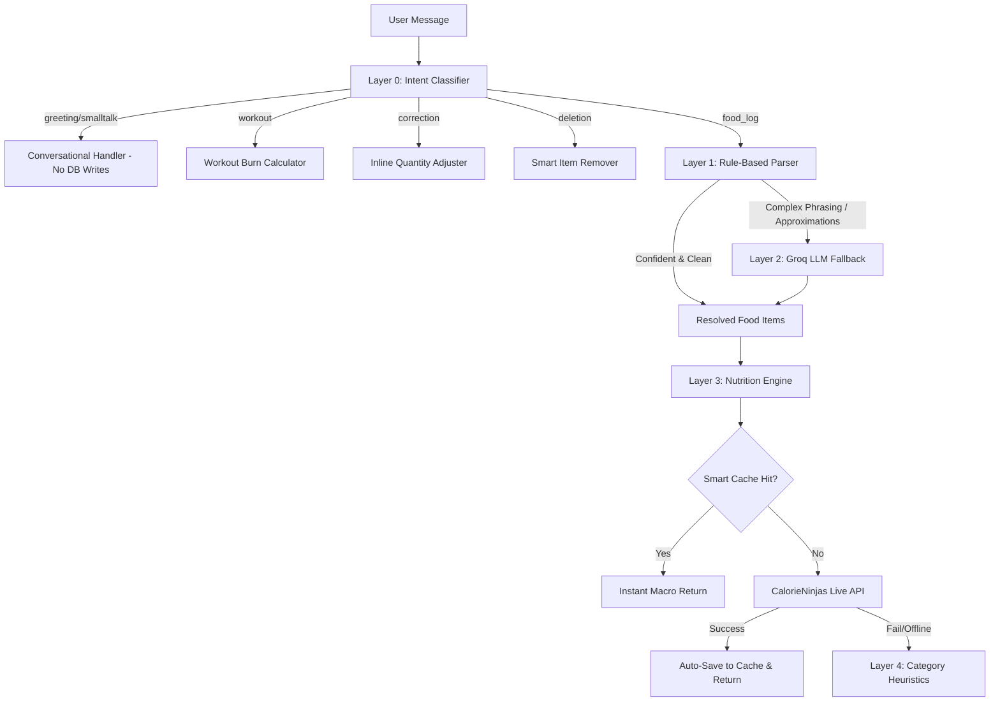

# Macroly AI Architecture & Intelligence Feature Log

A concise technical record of the multi-tiered AI interpretation engine, smart parsers, heuristics, and external APIs implemented in Macroly.

---

## 1. Multi-Tier AI & Processing Pipeline

---

## 2. Intelligence Layers & Features Added

### Layer 0: Intent Classification (Pre-Parser Guard)
* **Zero-Calorie Guard for Chit-Chat:** Greetings (*"hi"*, *"hello"*), gratitude (*"thanks"*), and small talk are handled conversationally with zero meals logged and zero database pollution.
* **Goal & Target Inquiry Detection:** Questions like *"what's my calorie goal today?"* answer the user with their personalized targets directly from their profile without invoking parsers.
* **Workout Detection:** Detects exercises (*"ran 30 mins"*, *"walked 1 hour"*, *"strength training"*) and computes caloric burn without food lookup.

---

### Layer 1: Rule-Based Parser (Sub-millisecond)
* **Isolated Multi-Item Splitting:** Multi-item conjunctions (`"and"`, `","`, `"&"`, `"+"`) process each phrase independently. No quantity leakage between items (e.g., *"2 corn pizza and 250ml milk"* &rarr; 2 pizzas, 1 milk).
* **Metric Volume & Weight Recognition:**
  * Direct metric bindings: `250ml`, `500ml`, `100g`, `200g`, etc.
  * Explicit phrases: `1 unit of 250ml milk`, `2 x 250ml milk`.
  * Preserves user-facing units (`250ml`) rather than generic defaults.
* **Staple Singular/Plural Normalization:** Automatically standardizes counts and units for staple foods (`"3 rotis"` &rarr; `3 roti`, `"2 eggs"` &rarr; `2 egg`).

---

### Layer 2: Approximation Handling & Groq LLM Routing
* **Conversational Noise & Approximation Filter:**
  * Flag words (`approx`, `approximately`, `around`, `roughly`, `about`, `nearly`, `along with`, `finished with`) immediately mark rule confidence as `False`.
  * Rather than making naive cuts on complex sentences, execution delegates to Groq LLM (`llama-3.3-70b-versatile` / `qwen/qwen3.8-27b`).
* **Ingredient Modifier Resolution (Anti-Double-Counting):**
  * When a user says *"chicken curry with approx 20gram chicken"*, the parser detects this as an **ingredient portion modifier**, not two separate dishes.
  * Captures the dish as `Chicken Curry (portion with 20g chicken)`.
* **Clean Name Stripping:** Strips qualifiers from item names so titles never display *"Approx 20Gram Chicken"*.

---

### Layer 3: Nutrition Engine & Scaling Logic
* **CalorieNinjas Integration (Replaced FatSecret):**
  * Full migration away from FatSecret's IP-whitelisted OAuth platform.
  * Native REST API using `X-Api-Key` &mdash; zero Error 21 blockers, zero IP restrictions on Railway.
  * Auto-scales components and sums compound ingredient responses.
* **Proportional Metric Scaling:**
  * **Volume (`ml`):** Automatically scales relative to standard 250ml glass (`250ml` = 1.0x, `500ml` = 2.0x).
  * **Weight (`g`):** Scales grams against base 100g serving (`20g chicken` = `0.20 * base`).
  * **Curry Meat Customization:** Calculates base gravy (~100 kcal, 2.5g P) + custom meat weight (~1.65 kcal/g, 0.31g P/g), resolving *"curry with 20g chicken"* to **133 kcal & 8.7g Protein** instead of a full 280 kcal / 32g bowl.

---

### Layer 4: Smart Cache & Database Dual-Mode
* **Pre-Seeded Catalog:** Seeded with staples (Roti, Dal Makhani, Chicken Curry, Paneer Tikka, Milk, Whole Milk, Corn Pizza, Toast, Greek Yogurt, Espresso, etc.).
* **Exact & Shortest-Match Precedence:**
  * Exact key matches always execute first.
  * Fixed substring match so single-word queries like `"milk"` never bind to longer items like `"iced latte with oat milk"`.
* **PostgreSQL + SQLite Resilience:** Hosted Supabase PostgreSQL dual-engine with zero-config local SQLite fallback if network connectivity drops.

---

## 3. Timeline of Key Milestones & Fixes

| Phase | What Was Built / Fixed | Impact |
| :--- | :--- | :--- |
| **Milestone 1** | Supabase Multi-Tenant Auth & Dashboard | Isolated data storage per user with Email & Google OAuth. |
| **Milestone 2** | Intent Classification Engine | Separated conversational queries from meal logs to avoid junk database entries. |
| **Milestone 3** | Conversational Corrections & Deletions | Enabled *"make that 3 rotis"* and *"remove the dal"* recalculations with delta feedback. |
| **Milestone 4** | Parser Multi-Item Isolation & Volume Parsing | Fixed `"2 corn pizza and 250ml milk"` so milk gets 1 unit of 250ml, not 2 glasses. |
| **Milestone 5** | FatSecret &rarr; CalorieNinjas Migration | Eliminated Error 21 IP blocks permanently on Railway dynamic server IPs. |
| **Milestone 6** | Approximation & Ingredient Modifier Engine | Prevented double-counting chicken in *"curry with 20g chicken"*, correcting protein from 63g &rarr; 35g. |
